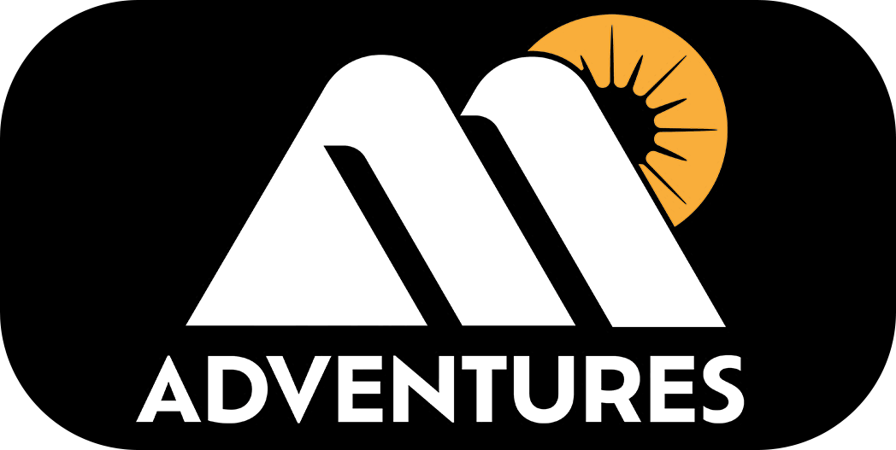
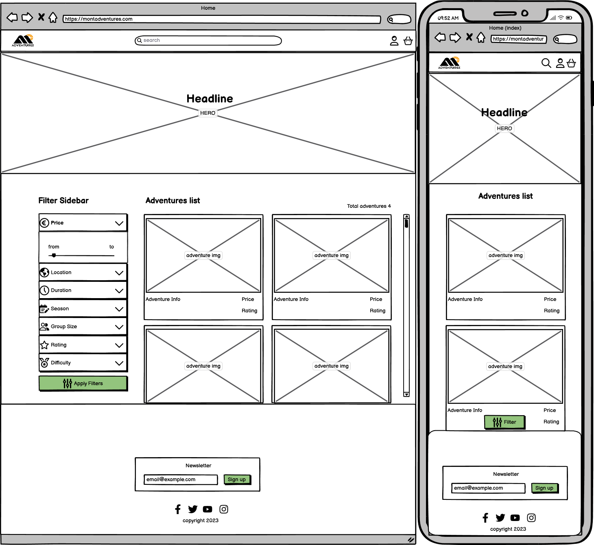
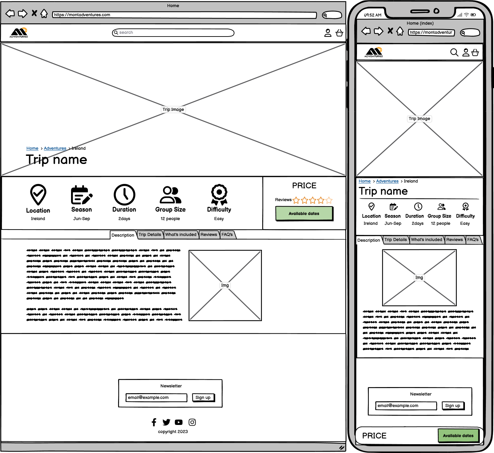
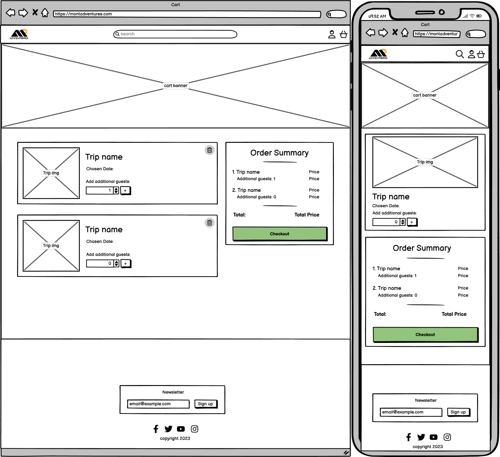
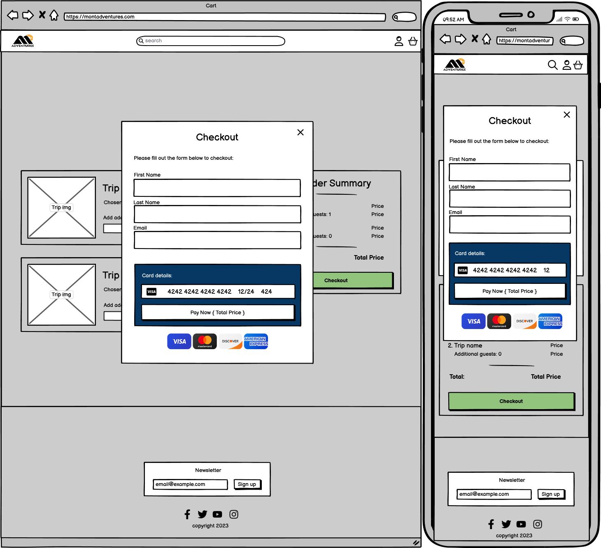

    

    

# 🏔️Introduction

Welcome to Mont Adventures, a comprehensive platform dedicated to making your next mountain-climbing adventure just a few clicks away. Designed specifically for thrill-seekers and outdoor enthusiasts, Mont Adventures combines a user-friendly interface with a robust set of features to create a seamless booking experience.

### Objectives

- To offer a booking platform that prioritizes user experience, encouraging users to complete their bookings efficiently.
  
- To provide a visually cohesive and intuitive UI/UX design that enhances user engagement, making it easier for them to find and book trips that suit their preferences.

- To deliver a secure and feature-rich admin panel that enables efficient management of trip packages, user accounts, and available dates.

- To continually refine and expand the platform based on user feedback and emerging trends in adventure travel.

### Target Audience

- **Mountain Climbers**: Whether you're a seasoned pro or a beginner looking to conquer your first summit, Mont Adventures has the perfect climbing package for you.

- **Adventure Travel Enthusiasts**: Even if mountain climbing isn't your primary interest, the platform offers a variety of adventure packages to satiate your thirst for thrill.

- **Outdoor Activity Organizers**: For those looking to book group trips or corporate events, Mont Adventures provides a simplified and efficient booking system.

- **Gift-Givers**: If you know someone with a passion for mountain climbing, Mont Adventures offers an easy way to gift an unforgettable experience.

### Problem Being Solved

- **Specialized Focus**: Unlike generic travel booking platforms, Mont Adventures is tailored to meet the unique needs and preferences of mountain climbers.

- **Curated Climbing Experiences**: Users can choose from a carefully curated list of climbing adventures, with options ranging from beginner-friendly ascents to challenging peak expeditions.

- **Streamlined Availability**: The platform offers detailed availability and pricing information for each trip, simplifying the planning process for your next climbing adventure.

### Scope

Mont Adventures aims to provide a seamless experience for adventure travelers interested in mountain climbing. The platform offers key functionalities including:

- A robust booking system that displays available dates and allows for easy selection and checkout.
- A detailed trip package interface, complete with trip details, additional images, and available dates.
- An advanced filtering system on the 'Trip Packages' page to help users find trips that fit their criteria.
- User accounts that allow for easier management of bookings, favorite trips, and reviews.
- An Admin CMS for comprehensive management of trip packages, available dates, and user accounts.

## 📜Table of Contents

1. [Introduction](#introduction)
    - [Objectives](#objectives)
    - [Target Audience](#target-audience)
    - [Problem Being Solved](#problem-being-solved)
    - [Scope](#scope)
2. [Business and Marketing Plan](#business-and-marketing-plan)
    - [Introduction](#introduction-1)
    - [Target Market](#target-market)
    - [Revenue Model](#revenue-model)
    - [Marketing Strategies](#marketing-strategies)
    - [Key Performance Indicators (KPIs)](#key-performance-indicators-kpis)
    - [Risks and Mitigation Strategies](#risks-and-mitigation-strategies)
3. [Development Plan](#🧑‍💻development-plan)
    - [Introduction](#introduction-1)
    - [Research and Initial Decisions](#research-and-initial-decisions)
    - [Point System and Estimation](#point-system-and-estimation)
    - [Timeline and Milestones](#timeline-and-milestones)
    - [Methodologies](#methodologies)
    - [Tech Stack](#tech-stack)
    - [Testing Strategy](#testing-strategy)
4. [UX/UI Design Plan](#uxui-design-plan)
    - [The Strategy Plane](#the-strategy-plane)
    - [The Scope Plane](#the-scope-plane)
    - [The Structure Plane](#the-structure-plane)
    - [The Skeleton Plane](#the-skeleton-plane)
    - [The Surface Plane](#the-surface-plane)
5. [Features](#features)
6. [Future Enhancements](#future-enhancements)
7. [Testing](#testing)
8. [Bugs](#bugs)
9. [Technologies Used](#technologies-used)
10. [Setup and Installation (GitHub and Heroku)](#setup-and-installation-github-and-heroku)
11. [Credits & Acknowledgements](#credits--acknowledgements)

# 📈Business and Marketing Plan

### Introduction

Mont Adventures aims to be the go-to platform for mountain climbing enthusiasts. Our focus is not just to provide a booking service but to offer a complete adventure experience. This section outlines the business and marketing strategies designed to make Mont Adventures a leader in specialized adventure travel booking.

### Target Market

The primary target market comprises adventure travelers with a focus on mountain climbing. These could be:

- Novice Climbers: Those who are new to mountain climbing and are looking for beginner-friendly experiences.
- Experienced Climbers: Individuals who have multiple climbs under their belt and are looking for new challenges.

### Revenue Model

1. **Commission-Based:** A percentage of each booking goes to Mont Adventures.
2. **Premium Listings:** Climbing organizers can pay to have their adventures featured.
3. **Merchandise Sales:** Selling adventure gear or memorabilia.

### Marketing Strategies

*Online Marketing*

1. **SEO:** Focused keyword targeting to rank higher on search engines.
2. **Social Media:** Leverage platforms like Instagram, where visuals can be highly engaging.
3. **Influencer Partnerships:** Collaborate with adventure vloggers and bloggers to showcase the platform.

*Offline Marketing*

1. **Adventure Expos:** Presence in adventure and travel expos to directly engage with the target audience.
2. **Local Partnerships:** Collaborate with local adventure clubs for mutually beneficial arrangements.

### Key Performance Indicators (KPIs)

1. **User Engagement:** Measured through metrics like session duration, page views, and bounce rate.
2. **Conversion Rate:** The percentage of website visits that turn into confirmed bookings.
3. **Customer Retention:** Measured through repeat bookings and customer reviews.

### Risks and Mitigation Strategies

1. **Seasonal Fluctuations:** Adventure travel often has peak and off-peak seasons. Diversifying adventure offerings can help mitigate this risk.
2. **Competitive Market:** Continuous updates and feature releases to stay ahead of competitors.

[⬆️Back to top](<#📜table-of-contents>)

---

# 🧑‍💻Development Plan

### Introduction

> The development of Mont Adventures was not just strategically planned but also meticulously tracked. Employing methodologies like Agile and tools like GitHub Kanban, the development process was both flexible and accountable. This section delves into the nitty-gritty of the development roadmap, methodologies, and technologies.

### Research and Initial Decisions

Before the development journey began, a comprehensive research plan was set into motion. This involved:

1. **Competitor Analysis:** Examining websites with similar functionalities to identify their strengths and weaknesses.

2. **Technology Stack Research:** While React was a prevalent choice among competitor websites for front-end development, it was not an option due to a lack of prior knowledge in the framework. Instead, Tailwind CSS, Daisy UI, and HTMX were chosen to achieve similar front-end features without the need to learn React.

3. **Feature Benchmarking:** Features across different platforms were compared to understand what's essential and what could give Mont Adventures a competitive edge.

4. **User Experience Research:** The user interfaces of competitors were studied to glean best practices and potential areas for innovation.

This robust research plan informed the development strategy, providing clear guidance on the technologies and features to focus on.

### Point System and Estimation

For the first time, the Fabiosci point system was employed to quantify the complexity and time estimation of various tasks. This point system allowed for a more structured allocation of tasks and helped in tracking progress effectively.

- **Epic Points:** Each epic was assigned a certain number of points, indicating its overall complexity and estimated time requirement.

- **User Stories Points:** Points were also allocated to individual user stories, helping in prioritizing and scheduling tasks.

### Timeline and Milestones

Phase 1: Core Functionality (Started on September 11, 2023)

**🏆Epic [#1](https://github.com/kpetrauskas92/Mont-Adventures-PP5/milestone/1):** Initial Setup, Backend, User Authentication, Frontend and Test Deployments 🚩(34 points)

**🏆Epic [#2](https://github.com/kpetrauskas92/Mont-Adventures-PP5/milestone/2):** Implementing Trip Package Management and User Cart Functionality 🚩(32 points)

**🏆Epic [#3](https://github.com/kpetrauskas92/Mont-Adventures-PP5/milestone/3):** Implementing Stripe Checkout Functionality 🚩(35 points)

**🏆Epic [#4](https://github.com/kpetrauskas92/Mont-Adventures-PP5/milestone/4):** Implementing Admin Dashboard & User Profile Functionality 🚩(29 points)

**👤Total User Stories:** 24

Phase 2: Polishing and Additional Features (Started on October 8, 2023)

**🏆Epic [#5](https://github.com/kpetrauskas92/Mont-Adventures-PP5/milestone/5):** Enhanced Interactivity and Robust Validation 🚩(23 points)

**🏆Epic [#6](https://github.com/kpetrauskas92/Mont-Adventures-PP5/milestone/6):** Feature Completion and User Engagement Boosters 🚩(31 points)

**🏆Epic [#7](https://github.com/kpetrauskas92/Mont-Adventures-PP5/milestone/7):** UI/UX Optimization Sprint 🚩(26 points)

**👤Total User Stories:** 17

Phase 3: XXXXXXXXXX

> Each epic corresponds to a weekly sprint, with tasks broken down into user stories and allocated points based on complexity and effort.

### Methodologies

- Agile Development: Utilized for its emphasis on iterative development and cross-functional collaboration.
- GitHub Kanban: Employed for efficient task management, facilitating the breakdown of milestones into epics and user stories.

### Tech Stack

### Testing Strategy

[⬆️Back to top](<#📜table-of-contents>)

---

# 🖌️UX/UI Design Plan

### The Strategy Plane

#### The Site's Ideal User
- **Target Audience**: Mountain climbers, from novices to experienced adventurers.
- **Needs**: Seamless booking, intuitive UI, real-time availability, and transparent pricing.
- **Behavior**: Likely to browse multiple trips before making a decision, possibly favoriting or sharing options.

#### Site Goals
- **User Engagement**: To provide an interactive and visually compelling platform that encourages users to explore and book mountain climbing adventures.
- **Ease of Use**: To offer a streamlined booking process that minimizes clicks and maximizes user satisfaction.
- **Consistency**: To maintain a uniform design language across all pages and touchpoints for a cohesive user experience.

> For details on the specific features planned to achieve these goals, please refer to the [Development Plan](#🧑‍💻development-plan).

### The Scope Plane

This plane defines the boundaries of the design project, outlining what is to be included in terms of features and functionalities.

#### Core Functionalities

- **User Sign In and Sign Up**: Secure and easy-to-navigate user authentication process for signing in and up.
- **Detailed Trip Packages**: Comprehensive details for each trip package including itinerary, pricing, and other essential information.
- **Advanced Filtering System**: An intuitive and user-friendly filtering system that allows users to narrow down trip options based on various attributes like date, price, and difficulty level.
- **Availability Information**: A system that displays available dates and booked slots for each trip, allowing users to make informed decisions.
- **Add to Cart**: A straightforward 'Add to Cart' feature that enables users to easily select trips they are interested in.
- **Adding Additional Guests**: A feature allowing users to add extra guests to their trip during the booking process.
- **Easy Checkout Flow**: A streamlined checkout process designed for user convenience.
- **Profile Management**: A user dashboard for managing personal information, viewing booked trips, and other account-related functionalities.
- **Admin Content Management**: A robust admin panel that allows for easy management of trip packages, user accounts, and other site content.

#### Secondary Features

- **Auto User Creation for Guests**: Guests are automatically assigned a user account upon successful checkout, with a generated password sent to them via email.
- **Trip Reviews**: A feature that allows users to post and read reviews about trips.
- **Favorite Trips**: Users can mark trips as favorites for easier access later.
- **Search Bar**: A simple search bar for keyword-based trip searching.
- **Carousels on Home Page**: Visual carousels featuring top trips and other content.
- **Real-Time Form Validation**: Instant client-side validation for forms to improve user experience.
- **Toast and Email Notifications**: Notifications for important user actions and updates, delivered both as in-app toasts and emails.

> By focusing on these core and secondary features, the UX/UI design aims to cover all the essential aspects that contribute to a seamless and engaging user experience.

#### Future Enhancements

These are functionalities and features that are not part of the initial design scope but are considered for future iterations of the platform to improve and expand its capabilities.

- **Booking Private Trips**: A feature allowing users to book trips exclusively for themselves or their group.
- **Book by Deposit**: An option to secure a booking by paying a deposit instead of the full amount.
- **Gift Cards**: The ability for users to purchase and redeem gift cards for trips.
- **Promo Codes**: Integration of promotional codes for discounts.
- **Social Sign Up, Sign In**: Allowing users to sign up and sign in using their social media accounts.
- **Vendor Access and Trip Submission**: A portal for trip vendors to submit and manage their own trip packages.
- **Live Profile Notifications**: Real-time notifications within the user's profile for important updates.
- **Chat Bot, Ticket System**: Customer service features including a chat bot for instant help and a ticket system for issue tracking.

#### Additional Consideration
- **Multi-language Support**: To make the platform accessible to a global audience.
- **Currency Conversion**: To automatically convert prices into the user's preferred currency.

> By considering these future enhancements, the platform aims to remain adaptable and aligned with user needs and market trends.

### The Structure Plane

This plane outlines the organization and arrangement of the platform's functionalities and content, detailing how users will navigate and interact with the platform.

#### Interaction Design
- **Navigation**: Clear and intuitive navigation menus will be placed on the header and footer, making it easy for users to find trip packages, their user profile, or admin panels.
- **User Flows**: Smooth user journeys are designed from the landing page to checkout, with minimal clicks and optimized pathways. Users can go from browsing trips to confirming their booking in just a few steps.
- **Feedback Mechanisms**: Visual cues such as toasts and modal confirmations will be used to confirm actions like adding trips to the cart or completing a booking.

#### Information Architecture
- **Content Grouping**: The website will have clearly marked sections for trip packages, user account management, and admin functionalities. 
- **Hierarchy**: A clear hierarchy will guide user attention towards primary actions like 'Book Now' and 'Add to Cart'.
- **Search and Filters**: An advanced search and filtering system will help users quickly find trips based on various attributes like date, price, and difficulty level.

#### Page Layouts
- **Home Page**: Features a hero image with a call-to-action (CTA) button and a headline. Also includes carousels for countries and top trips.
- **Trip Packages Page**: A comprehensive listing of all available trips, which can be filtered through a sidebar filtering system.
- **Trip Detail Page**: Provides all necessary information about a specific trip, including available dates, and allows users to either book the trip or add it to their cart.
- **User Profile**: Includes sections for upcoming trips, favorite trips, trip reviews, and settings. Users can also edit their personal details here.
- **Admin CMS**: Equipped with all necessary tools for managing customers, orders, trip packages, and available dates.

#### Data Structures

- **Trips**: Captures comprehensive details about each travel package, including visuals, pricing, duration, location, and seasonal availability. It also includes variables like maximum group size and overall trip ratings to offer a complete picture to potential customers.

- **TripImage**: Stores additional images for each trip, enhancing the visual presentation and helping users get a fuller understanding of what to expect.

- **AvailableDate**: Manages the scheduling aspect of each trip. It keeps track of the range of dates the trip is available, how many slots are booked, and whether or not more bookings can be made.

- **CustomerIDCounter**: Generates unique identifiers for customers, simplifying user management and ensuring each customer has a distinct identity within the system.

- **UserProfile**: Holds personalized information for each user, including contact details and emergency contacts. It also manages the visual aspects of user profiles, like profile images.

- **FavoriteTrip**: Allows users to mark trips as favorites, making it easier for them to find these trips later and possibly book them.

- **Reviews**: Offers a platform for users to share their experiences and ratings for each trip, which not only serves as feedback but also as a reference for future customers.

- **Order**: Manages the financial transactions for booking trips, keeping a detailed log of each order, including the user who made the purchase and the total amount spent.

- **OrderLineItem**: Breaks down each order into individual components, detailing the specific trips booked, the dates chosen, and the number of guests included.

> These data structures are designed to offer a comprehensive, user-friendly platform for both trip management and customer interaction.

#### Dynamic Elements

- **Modals**: Used for various user interactions including but not limited to sign-in, sign-up, forgot password, and confirming actions. They provide an overlay experience keeping the user on the same page.

- **Drawers**: Employed in the sidebar for advanced trip filtering and in the trip detail page for showing available dates and booking options. They slide in from the side, offering additional information without navigating away from the page.

- **Live Price Update**: When users add additional guests to a trip, the price dynamically updates on the page without requiring a reload, providing real-time feedback.

- **Admin-Generated Dates**: The admin has the ability to run a custom script to generate available dates for trips, which then can be instantly reflected on the trip details page.

- **Navigation Dropdowns**: Dropdown menus are used for additional options under menu icons, providing a clean UI while still offering multiple functionalities.

- **HTMX Integration**: Utilized for real-time updates in the trip package drawer, allowing information to be updated seamlessly without reloading the page.

> This approach to dynamic elements aims to create a more interactive and responsive user experience, without requiring full page reloads.

#### User Pathways

- **Guest Users**:
  1. Land on the homepage, greeted by a hero image and CTA button.
  2. Navigate through the carousel of countries and top trips.
  3. Explore trip packages through the 'Trip Packages' page, with the option to filter via the sidebar.
  4. Click to view trip details, including available dates.
  5. Proceed to checkout as a guest, with auto account creation on successful checkout.

- **Registered Users**:
  1. Sign in through a modal dialog.
  2. Land on the homepage and explore its features.
  3. Navigate to the 'User Profile' for managing upcoming trips, favorites, and reviews.
  4. Add trips to favorites for easier access later.
  5. Make bookings through the available dates drawer on trip details page.

- **Admin Users**:
  1. Sign in with elevated permissions.
  2. Navigate to the Admin CMS dashboard for managing customers, orders, and trip packages.
  3. Utilize custom scripts for generating available dates for trips if needed.
  4. Manage user accounts and roles.

> Each pathway is designed to offer the most streamlined experience possible for the user type, making navigation intuitive and actions easily accessible.

### The Skeleton Plane

#### Wireframe Mock-ups

Wireframes for key pages have been designed to visualize the layout and functionality of the platform. This helps in providing a clear roadmap for development and ensures that user experience is a focal point from the beginning.

<b>Homepage</b>

.png)

<b>Trip Packages</b>

<b>Trip Details</b>

<b>Cart</b>

<b>Checkout</b>

<b>User Profile</b>

<b>Admin CMS</b>

Admin CMS Wireframe

#### Database Schema

The database is designed around three primary models: `Trips`, `UserProfile`, and `Order`, with auxiliary models like `TripImage`, `AvailableDate`, `FavoriteTrip`, `Reviews`, and `OrderLineItem` supplementing them.

- **Trips**: Holds detailed information about each mountain climbing package, including images, pricing, duration, and more.
  
- **UserProfile**: Stores user-specific data such as favorite trips and reviews, linked to Django's built-in User model.
  
- **Order**: Manages the checkout process, containing all the information related to a user's order.

These models interact to provide a cohesive and functional backend for Mont Adventures.

#### Dynamic Elements

- **Modals**: Used for user authentication, password recovery, action confirmations, and the checkout process.
  
- **Drawers**: Employed in the sidebar for trip filtering and for selecting available dates for a trip.
  
- **Live Updates**: Price updates when additional guests are added, and the trip package drawer updates instantly with HTMX.

- **Nav Dropdowns**: Utilized for menu links and icons, enhancing navigation.

#### User Pathways

- **Guest Users**: Land on the homepage, browse trip packages, use filters, and have the option to book as a guest.
  
- **Registered Users**: Have the added ability to save favorite trips, view upcoming trips in their profile, and leave reviews.
  
- **Admin Users**: Access to the Admin CMS for managing trip packages, orders, and customer accounts.

### The Surface Plane

#### Design

> The design philosophy of Mont Adventures revolves around ease of use, with a visually appealing interface that invites users to explore and book mountain climbing adventures. 

#### Typography

> The typography is carefully chosen to be readable and visually pleasing, making use of modern sans-serif fonts for readability and a touch of serif for accents.

#### Imagery

> High-quality images are used to represent each mountain climbing package, offering a visual feast that complements the textual information. The images aim to inspire and engage the user, giving them a glimpse of what they can expect from each adventure.

#### UX/UI Consistency

> A consistent design language is maintained throughout the site to provide a seamless user experience. This is achieved through the consistent use of colors, buttons, and layout structures.

#### User Feedback Loops

> Toast notifications and email alerts are used to provide real-time feedback to the user, thereby enhancing user engagement and trust.

#### Performance Optimization

> Efforts are made to keep the site performance-optimized, ensuring quick load times and smooth interactivity, which is crucial for user retention.

### Design Principles

These are the underlying principles that guide the UX/UI design of the platform, ensuring an inclusive and efficient user experience.

- **Responsiveness**: The design will adapt to various screen sizes, ensuring a consistent experience across desktop, tablet, and mobile devices.
- **Accessibility**: Compliance with accessibility guidelines to make the platform usable for as many people as possible, including those with disabilities.
- **UX/UI Consistency**: A uniform design language and interaction patterns will be maintained across all pages and touchpoints.
- **User Feedback Loops**: Mechanisms for capturing and addressing user feedback will be integrated into the platform.
- **Performance Optimization**: Steps will be taken to ensure that the platform performs efficiently, with quick load times and responsive interactions.

> By adhering to these design principles, the aim is to create a platform that is not only visually appealing but also functional and inclusive for all users.

[⬆️Back to top](<#📜table-of-contents>)

---

# ⭐Features

# 🌠Future Enhancements

# 🧮Testing

# 🪲Bugs/Issues

# 🤖Technologies Used

# ⚙️Setup and Deployment

> The site was deployed via Heroku, and the live link can be found here - [Mont Adventures](https://mont-adventures-pp5-23ff8a97d0dd.herokuapp.com/)

### Project Deployment: Heroku

#### 1. **Initial Setup on Heroku:**

* Sign up or log in to [Heroku](https://www.heroku.com/).
* On the main Heroku Dashboard, click 'New' > 'Create New App'.
* Name your project (e.g., `mont-adventures-pp5`). Remember, the app name must be unique.
* Choose a suitable region and then click 'Create app'.

#### 2. **Setting Up the Database:**

* Navigate to the 'Resources' tab from the submenu.
* In the 'Add-ons' section, search for 'Heroku Postgres'.
* Select and add 'Heroku Postgres' as the database.
* Go to the 'Settings' tab, and within the 'Config Vars' section, copy the `DATABASE_URL` for later use.

#### 3. **Configuring Django App for Heroku:**

* Create a `.env` file at the root of your Django project.
  * Add `DATABASE_URL=<your_database_url_from_heroku>`
  * Add `SECRET_KEY=<your_secret_key>`

* Add these variables to the Heroku 'Config Vars'.
* Modify `settings.py` in your Django app:
  * Import `dotenv` and load `.env` with `dotenv.load_dotenv()`.
  * Replace the default secret key with `SECRET_KEY = os.environ.get('SECRET_KEY')`.
  * Update the databases section to connect to the Heroku Postgres: `DATABASES = {'default': dj_database_url.parse(os.environ.get("DATABASE_URL"))}`.

#### 4. **Setting Up AWS S3:**

* Visit [AWS S3](https://aws.amazon.com/s3/) and either sign in or create an account.
* Create a new S3 bucket and note down the necessary configurations like `AWS_S3_ENDPOINT_URL` and `AWS_STORAGE_BUCKET_NAME`.
* Add these configurations to your `.env` file.
* Add these variables to Heroku 'Config Vars'.
* Modify `settings.py` to configure AWS S3:
  * Add AWS configurations for static and media files.

#### 5. **Final Configurations:**

* Link your templates directory in Heroku: `TEMPLATES_DIR = os.path.join(BASE_DIR, 'templates')`.
* Update the templates directory to `TEMPLATES_DIR`: `'DIRS': [TEMPLATES_DIR]`.
* Add your Heroku app to `ALLOWED_HOSTS` (format: `app_name.herokuapp.com`).
* Create three top-level directories in your project: `media`, `static`, `templates`.
* Add a `Procfile` at the top level and write: `web: gunicorn PROJECT_NAME.wsgi`.
* Commit and push your changes to GitHub.

#### 6. **Deploy on Heroku:**

* In Heroku, go to the 'Deploy' tab.
* Deploy the branch manually and monitor the build logs for any issues.
* Once the build completes, you'll see a success message and a link to view the live site.

> **Note**: Replace placeholders like `<your_database_url_from_heroku>`, `<your_secret_key>`, `<PROJECT_NAME>` with actual values relevant to your project.

#### Forking the Repository

Forking the GitHub Repository allows you to have a copy of the original repository. This enables you to view or make changes without affecting the original content.

To fork the repository:

1. Log into [GitHub](https://github.com/) or create an account.
2. Navigate to the repository: [Mont Adventures](https://github.com/kpetrauskas92/Mont-Adventures-PP5).
3. At the top-right corner of the repository page, click on the "Fork" button.
4. A copy of the repository will now be available in your account.

#### Cloning the Repository

Cloning creates a local copy of the repository on your machine, allowing you to run and modify the project locally.

To clone the repository:

1. Visit the [Mont Adventures repository](https://github.com/kpetrauskas92/Mont-Adventures-PP5).
2. Click on the green "Code" button located at the top of the file list.
3. Choose the "Clone with HTTPS" option and copy the provided URL to your clipboard.
4. Open your preferred code editor or terminal.
5. Change your current directory to the location where you want to clone the repository.
6. Type `git clone`, then paste the URL you copied.
7. Press `Enter`, and the repository will be cloned to your specified directory.

[⬆️Back to top](<#📜table-of-contents>)

---

# 🎓Credits & Acknowledgements
