### Testing Documentation for Mont Adventures PP5

### Table of Contents
- [Introduction](#introduction)
- [Testing Strategy](#testing-strategy)
- [Types of Testing Conducted](#types-of-testing-conducted)
- [Tools Used](#tools-used)
- [Test Cases](#test-cases)
- [Browser Developer Tools Testing](#browser-developer-tools-testing)
- [User Acceptance Testing](#user-acceptance-testing)
- [Test Cases - by Features](#test-cases---by-features)
  - [Home Page Features](#home-page-features)
  - [Explore Page Features](#explore-page-features)
  - [Trip Detail Page Features](#trip-detail-page-features)
  - [Cart and Checkout Features](#cart-and-checkout-features)
  - [User Profiles](#user-profiles)
  - [Other Features](#other-features)
- [Code Validation](#code-validation)
- [Validation Tests/Results](#validation-testsresults)
  - [CI Python Linter Results](#ci-python-linter-results)
  - [JSLint Results](#jslint-results)
  - [W3C Validator HTML/CSS Results](#w3c-validator-htmlcss-results)
  - [Wave Accessibility Results](#wave-accessibility-results)
  - [PageSpeed Insights Results](#pagespeed-insights-results)
- [Bugs and Fixes](#bugs-and-fixes)
- [Conclusion](#conclusion)

### Introduction

Welcome to the Testing Documentation for Mont Adventures. This document provides a detailed overview of comprehensive testing strategy, methodologies, and practices applied throughout the development lifecycle of this project. The primary goal of this documentation is to offer transparency and insight into rigorous testing processes, ensuring the highest quality and reliability.

In this document, you will find:

- A thorough explanation of testing strategy, including the types of testing conducted.
- Descriptions of the tools and technologies used in testing processes.
- Detailed test cases covering various aspects of the application, including unit, integration, system, and user acceptance tests.
- Sections dedicated to code validation, including linters and syntax checks for HTML, CSS, and JavaScript.
- Insights into responsive design testing, ensuring application's optimal performance across different devices and screen sizes.
- Performance analysis procedures and results, highlighting efforts to optimize speed and efficiency.
- Accessibility testing measures undertaken to guarantee an inclusive user experience.
- SEO testing practices, ensuring that the application is not only functional but also discoverable and aligned with best practices for search engine rankings.

### Testing Strategy

The testing strategy for Mont Adventures is centered around a comprehensive manual testing process, supported by unit testing to ensure code reliability. This approach was chosen to closely mirror the user experience and to catch issues that automated testing might miss.

### Types of Testing Conducted
Unit Testing

- Purpose: To validate the functionality of individual units of code, ensuring they work as intended.
- Approach: Writing and executing unit tests after the development of features, focusing on small, isolated parts of the application.

Manual Testing

- Primary Focus: As the backbone of our testing strategy, manual testing covers various aspects of the application to ensure a seamless user experience.
- Approach: Conducted by team members simulating real-world usage scenarios to identify usability issues, design inconsistencies, and functional bugs.
- Areas Covered:
    - User Interface (UI) and User Experience (UX): Assessing visual appeal, ease of navigation, and intuitiveness.
    - Exploratory Testing: Randomly navigating the application to uncover unexpected behavior.
    - System Testing: Evaluating the complete and integrated application against requirements.
    - User Acceptance Testing (UAT): Gathering feedback from end-users to ensure the application meets their needs and expectations.
    - Compatibility Testing: Ensuring the application performs well across different browsers and devices.

This combination of manual and unit testing allows to thoroughly evaluate Mont Adventures from both technical and user-centric perspectives.

---

[⬆️Back to top](<#table-of-contents>)

### Tools Used

The following tools and technologies were essential in the testing process of Mont Adventures. They were carefully selected to ensure thorough testing coverage and to align with testing strategy.
For Unit Testing

- unittest: Utilized for writing and executing unit tests in Python. These frameworks are instrumental in testing the smallest units of code for their functionality and reliability.
- Coverage.py: Used in conjunction with unit testing frameworks to measure the code coverage of unit tests, ensuring that a significant portion of the codebase is tested.

For Manual Testing

- Browser Developer Tools (Chrome, Firefox, Edge, etc.): Essential for inspecting HTML/CSS, debugging JavaScript, and testing responsive designs directly in the browser.
- Device Testing: Using a variety of devices (smartphones, tablets, laptops) to manually test the application and ensure compatibility and responsiveness across different screen sizes and operating systems.

Additional Tools

- Github Projects: Project management tool used to track bugs, tasks, and features, organizing the workflow and ensuring efficient progress through testing phases.

Accessibility and SEO

- WAVE (Web Accessibility Evaluation Tool): For manual accessibility checks, ensuring the website is accessible to individuals with disabilities.
- Google Lighthouse: An automated tool used for performance metrics, SEO evaluation, and accessibility checks.

These tools were integral in helping achieve a high standard of quality and reliability, each serving a specific purpose within the testing framework.

---

[⬆️Back to top](<#table-of-contents>)

### Test Cases

Unit Testing (Automated Test)

Test Case Overview

Throughout the development of Mont Adventures, a range of unit tests were implemented, reflecting different modules and functionalities of the application. Below is an overview of the test cases developed:

    - Cart Module Tests
        cart\tests\test_utils.py
        cart\tests\test_views.py

    - Checkout Module Tests
        checkout\tests\test_checkout_utils.py
        checkout\tests\test_forms.py
        checkout\tests\test_models.py
        checkout\tests\test_signals.py
        checkout\tests\test_views.py
        checkout\tests\test_webhook_handler.py

    - Profiles Module Tests
        profiles\tests\test_forms.py
        profiles\tests\test_models.py
        profiles\tests\test_views.py

    - Trip Packages Module Tests
        trip_packages\management\commands\test_generate_dates.py
        trip_packages\tests\test_models.py
        trip_packages\tests\test_views.py

Reflection on Test Coverage

The initial goal was to achieve a test coverage of 90%. However, due to time constraints towards the end of the project, the final coverage stood at 75%. This is still a significant achievement, especially considering the challenges encountered during development.

- Key Challenges: One of the more complex aspects of testing was the webhook handler in the checkout module. Although it was challenging to set up and test, it remains a critical component of the application.
- Satisfaction with Outcome: Despite falling short of the initial coverage goal, all implemented tests run without errors, indicating a stable and reliable codebase. This outcome is commendable, given the time constraints and the learning curve involved in applying unit testing for the first time.

Generating Coverage Report

To generate the coverage report, a specific set of commands was used. The report provided valuable insights into the areas of the code that were well-tested and those that could benefit from additional testing. The command used to generate this report:

`coverage run manage.py test cart.tests`

`coverage run -a manage.py test checkout.tests`

`coverage run -a manage.py test profiles.tests`

`coverage run -a manage.py test trip_packages.tests`

Reflection on Unit Testing Experience

As part of the development process for Mont Adventures, I embarked on incorporating unit testing for the first time. This experience was both enlightening and challenging, offering a new perspective on the role of testing in software development.
Initial Approach to Unit Testing

At the outset of the project, I integrated unit testing with an aim to ensure code reliability and functionality. This approach was beneficial in several ways:

- Improved Code Quality: Unit tests helped in identifying bugs early in the development cycle, ensuring higher code quality.
- Documentation Aspect: The tests also served as a form of documentation, clearly outlining what each part of the code was intended to do.

Challenges Encountered

Despite the advantages, there were significant challenges faced in consistently implementing unit testing:

- Time-Consuming Process: As the project scaled, the time required to write and maintain unit tests became substantial. Balancing the demands of development with thorough testing proved to be a difficult task.
- Efficiency Concerns: The realization dawned that to meet project deadlines and maintain progress, the focus on unit testing had to be adjusted. The need to deliver a finished product within a reasonable timeframe necessitated a more pragmatic approach to testing.

Lessons Learned and Moving Forward

This journey with unit testing has been a learning curve, highlighting the importance and challenges of testing in software development:

- Valuable Tool with Considerations: Unit testing is undoubtedly a powerful tool for ensuring software quality, but it requires careful planning and integration, especially in time-sensitive projects.
- Future Strategies: In future projects, I plan to adopt a more balanced approach, possibly integrating automated testing and adopting a test-driven development (TDD) approach to enhance efficiency.

This experience has reinforced the idea that testing, while essential, needs to be adapted to the scope and timeline of the project. Moving forward, I will leverage the lessons learned from this experience to implement a more efficient and effective testing strategy in my future projects.

---

[⬆️Back to top](<#table-of-contents>)

### Browser Developer Tools Testing

In addition to unit testing, Browser Developer Tools were extensively used to test and validate the front-end functionalities of Mont Adventures. This testing focused on ensuring compatibility, responsiveness, and correct functionality across various web browsers.

1. HTML/CSS Inspection

- Test Execution: Completed successfully on Chrome, Firefox, and Edge.
- Observations: HTML structure is well-formed with no errors or warnings. CSS is consistently implemented across browsers with no discrepancies.
- Result: Passed. The application's HTML and CSS are correctly implemented and render as expected in all tested browsers.

2. JavaScript Debugging

- Test Execution: Conducted on multiple browser types.
- Observations: All JavaScript functions and events executed as expected. The console and debugger tools did not identify any errors or issues.
- Result: Passed. JavaScript functionality is robust and error-free across different browsers.

3. Responsive Design Testing

- Test Execution: Performed using the responsive design mode in developer tools across various simulated screen sizes.
- Observations: The application maintained usability and aesthetic integrity at all tested sizes. Layout adjustments and media queries functioned as intended.
- Result: Passed. The application is fully responsive and adapts well to different screen sizes.

Device Testing

1. Cross-Device Functionality

- Test Execution: Successfully completed on a range of smartphones, tablets, and laptops.
- Observations: All features functioned consistently across different device types. Touch, keyboard, and mouse inputs were all responsive and accurate.
- Result: Passed. The application exhibits consistent and correct functionality on a variety of devices.

2. Cross-OS Compatibility

- Test Execution: Executed on iOS, Android, Windows, and macOS devices.
- Observations: Core functionalities operated without issues on all operating systems. User experience remained uniform across different platforms.
- Result: Passed. The application is compatible with and functions consistently across diverse operating systems.

3. Screen Size and Resolution Testing

- Test Execution: Conducted on devices with a wide range of screen sizes and resolutions.
- Observations: No layout issues, image distortions, or text readability problems were observed. The application adapted well to various display characteristics.
- Result: Passed. The application is visually appealing and functionally effective on all tested screen sizes and resolutions.

---

[⬆️Back to top](<#table-of-contents>)

### User Acceptance Testing

#### Overview

Introduction

Mont Adventures is a feature-rich application, encompassing a wide array of functionalities aimed at enhancing the user experience, the User Acceptance Testing (UAT) phase presented a significant challenge. This phase of testing was crucial in ensuring that each feature not only meets its technical specifications but also aligns with the real-world expectations and needs of the users. Given the breadth and depth of features, ranging from intuitive navigation elements to complex transactional processes, the UAT was a comprehensive endeavor.

Scope of UAT

The UAT for Mont Adventures covered a diverse set of features, each integral to the overall user experience. These included:

- Navigational elements like a minimalist navbar and dynamic dropdown menus.
- Search functionality with real-time results and curated trip suggestions.
- A visually captivating hero section with a responsive design.
- Informative and engaging content sections such as the About and Location Carousels.
- Interactive user interfaces like the Top Adventures Carousel and various modals.
- Detailed and user-friendly trip exploration and booking features.
- Comprehensive user profile management capabilities.
- Robust cart and checkout processes with real-time validations.
- Custom error handling for an enhanced user experience.

Challenges in UAT

- Feature Diversity: With such a wide range of features, ensuring comprehensive coverage in testing was a substantial task.
- User-Centric Approach: The focus was on testing from the end-user’s perspective, which required a thorough understanding of user expectations and behavior.
- Responsiveness and Compatibility: Given the diversity of devices and browsers used to access the application, ensuring consistent performance across all platforms was crucial.
- Real-World Scenarios: Simulating real-world usage scenarios to capture the nuances of user interactions with the application.
- Feedback Integration: Efficiently incorporating feedback from test participants into the development cycle to enhance feature functionality and user experience.

Strategy and Execution

The UAT was conducted methodically, focusing on one section at a time to ensure thorough evaluation and attention to detail. The testing involved:

- Gathering a group of test participants to cover various user perspectives.
- Creating real-world test scenarios for each feature.
- Continuous monitoring and integration of feedback throughout the testing process.

Conclusion

The UAT for Mont Adventures was a critical step towards ensuring that the application is not just functionally robust but also resonates well with its intended users. This comprehensive testing approach has helped in fine-tuning the application, ensuring that it delivers an engaging, intuitive, and seamless experience to its users.

---

[⬆️Back to top](<#table-of-contents>)

## Test Cases - by Features

### Home Page Features

### 1. Navigation

Objective: To ensure the navbar is user-friendly, aesthetically pleasing, and functions well on both desktop and mobile views.

- Test Steps for Desktop:
    - Observe the aesthetic appeal and layout of the navbar.
    - Test the functionality of navigation links and observe hover effects.
        Ensure quick and accurate redirection to relevant pages upon link clicks.

- Test Steps for Mobile:
    - Assess the navbar's visual and functional adaptability to smaller screens.
    - Verify the ease of accessing menu items and their responsiveness.

- Expected Outcome: The navbar should provide a clean, easy-to-navigate experience, with all links functioning correctly.

- Result: Pass

---

2. Search Functionality

Objective: Test the efficiency, responsiveness, and user engagement of the search feature.

- Search Drawer Test:
    - Engage the search drawer and observe the smoothness of its animation.
    - Test the drawer's functionality across different devices.

- Real-Time Search Test:
    - Input various search queries and assess the speed and accuracy of results.
    - Verify the dynamic updating of results as the query is typed.

- Curated Trip Suggestions Test:
    - Evaluate the relevance and appeal of the suggested trips.
    - Test the functionality of suggestion links.

Expected Outcome: The search feature should provide fast, accurate results and enhance user engagement with effective trip suggestions.

- Result: Pass

---

3. Dynamic Dropdown Menus

Objective: Ensure dropdown menus are responsive and cater to different user states.

- Test for Various User States:
    - Log in as different user types (guest, registered user, superuser).
    - Test the functionality and relevancy of menu options for each state.

- Dropdown Functionality Test:
    - Check the smooth operation of dropdowns in different user states.
    - Verify that each menu option leads to the correct page or action.

Expected Outcome: Dropdown menus should accurately reflect user states and provide seamless navigation.

- Result: Pass

---

### 2. Hero Section

Objective: To verify that the fullscreen image in the hero section is visually appealing and makes a strong first impression on the visitor.

- Test Steps for Desktop:
    - Observe the image's visual impact upon first loading the homepage.
    - Assess the quality, resolution, and alignment of the image.
    - Ensure the image complements the overall website design.

- Test Steps for Mobile:
    - Evaluate the image's appearance and loading speed on various mobile devices.
    - Check for any layout shifts or distortions on different screen sizes.

Expected Outcome: The hero image should be striking, load efficiently, and be well-integrated with the site's design on all devices.

- Result: Pass

2. Responsive Design for Different Devices

Objective: Ensure that the hero image is optimized and responsive across various devices.

- Test Steps:
    - Access the website on a range of devices including desktops, tablets, and smartphones.
    - Observe the image scaling and responsiveness on each device.
    - Test the loading speed of the image on different screen sizes and network conditions.

Expected Outcome: The hero image should look great, load quickly, and maintain its visual appeal across all device types.

- Result: Pass

3. Sticky Heading with Call-to-Action (CTA)

Objective: Test the functionality and effectiveness of the sticky heading and CTA button as users scroll.

- Test Steps:
    - Scroll down the page and observe the behavior of the sticky heading.
    - Interact with the CTA button and assess its responsiveness.
    - Ensure the CTA button remains visible and accessible as users navigate the site.

Expected Outcome: The sticky heading and CTA button should remain in view, be easily accessible, and function correctly to encourage user engagement.

- Result: Pass

---

### 3. About Section

1. Brand Overview and Mission

Objective: Ensure that the About Section effectively presents the brand's overview and mission, engaging the visitor with the essence of the brand.

- Test Steps for Desktop:
    - Access the About Section on a desktop and assess the presentation of the brand's values and mission.
    - Evaluate the readability and visual layout of the content.
    - Check for alignment, text formatting, and overall aesthetic appeal.

- Test Steps for Mobile:
    - Review the About Section on various mobile devices.
    - Ensure that the content is easily readable and visually appealing on smaller screens.
    - Test for any layout issues or text cutoffs on different mobile devices.

Expected Outcome: The About Section should effectively convey the brand's message, be visually engaging, and maintain high readability across devices.

- Result: Pass

---

2. Engagement and Connection

Objective: Verify that the About Section connects with visitors and narrates the brand's story compellingly.

- Test Steps:
    - Assess the emotional impact and engagement level of the content.
    - Ensure that the narrative is compelling and resonates with the intended audience.
    - Gather feedback from a small group of test users about their emotional connection and understanding of the brand after reading the section.

Expected Outcome: The section should not only inform but also create a strong emotional connection with the audience, enhancing their understanding of the brand.

- Result: Pass

---

3. Responsive and Interactive Design

Objective: Test the responsiveness and interactivity of the About Section across different devices.

- Test Steps:
    - Access the About Section on a range of devices, including desktops, tablets, and smartphones.
    - Interact with any interactive elements in the section (if applicable).
    - Observe the adaptability of the design and content on various screen sizes.

Expected Outcome: The About Section should maintain its aesthetic appeal, interactivity, and readability, offering a consistent user experience on all devices.

- Result: Pass

---

### 4. Location Carousel

1. Browse by Destinations

Objective: Ensure that the Location Carousel accurately displays various travel destinations and the number of available trips, providing an intuitive browsing experience.

- Test Steps for Desktop:
    - Access the Location Carousel on a desktop.
    - Verify that each destination card displays the correct number of trips.
    - Test the functionality of navigation buttons - ensuring they reveal additional destinations as expected.

- Test Steps for Mobile:
    - Review the Location Carousel on various mobile devices.
    - Confirm that navigation buttons are hidden and the swipe functionality works smoothly.
    - Check for clear visibility and accurate display of trips per location on the cards.

Expected Outcome: The carousel should offer an intuitive way to browse destinations with accurate trip counts, and the navigation should work seamlessly on both desktop and mobile views.

- Result: Pass

---

2. Interactive Trip Filtering

Objective: Verify that each destination card in the carousel acts as an effective filter and leads users to a page displaying all trips for the selected location.

- Test Steps:
    - Click or tap on various destination cards in the carousel.
    - Confirm that each card accurately filters and directs to a page with trips for the chosen location.
    - Test the responsiveness and speed of the filtering action.

Expected Outcome: Selecting a destination card should quickly and accurately filter the trips, enhancing the user's trip selection process.

- Result: Pass

---

3. Carousel Functionality

Objective: Test the overall functionality and user experience of the carousel, including swipe actions and responsive design.

- Test Steps:
    - Interact with the carousel on different devices to test swiping (on mobile) and clicking (on desktop).
    - Ensure smooth transitioning between cards without lag or glitches.
    - Assess the responsiveness of the carousel's design on varying screen sizes.

Expected Outcome: The carousel should function smoothly with effective swiping and clicking actions, providing a seamless experience across devices.

- Result: Pass

---

### 5. Top Adventures Carousel

1. Showcase of Popular Trips

Objective: Verify that the Top Adventures Carousel effectively showcases the top 8 trips, as favorited by users, and draws visitor attention to popular choices.

- Test Steps for Desktop:
    - Access the Top Adventures Carousel on a desktop.
    - Confirm that the carousel displays the top 8 favorited trips.
    - Check the visual appeal and layout of the carousel.

Test Steps for Mobile:
    - Review the carousel on various mobile devices.
    - Ensure that it adapts well to smaller screens while maintaining usability and visual quality.
    - Verify the functionality of swiping through the carousel on mobile devices.

Expected Outcome: The carousel should prominently display the top trips, with clear images and descriptions, and offer a smooth browsing experience on both desktop and mobile.

- Result: Pass

---

2. Engagement and Discovery

Objective: Test the carousel's ability to engage users and facilitate discovery of popular trips.

- Test Steps:
    - Interact with the carousel to browse through the featured trips.
    - Assess the ease of navigating between different trips within the carousel.
    - Verify that each trip card in the carousel is clickable and leads to the detailed trip page.

Expected Outcome: Users should find the carousel engaging and easy to navigate, with each trip card providing a gateway to more detailed information, thereby aiding in trip selection.

- Result: Pass

---

3. Carousel Functionality and User Experience

Objective: Ensure the overall functionality and responsiveness of the Top Adventures Carousel across different devices.

- Test Steps:
    - Interact with the carousel using both click (desktop) and swipe (mobile) actions.
    - Test the responsiveness of the carousel’s design on various screen sizes and orientations.
    - Evaluate the transition effects and loading times for the carousel.

Expected Outcome: The carousel should function smoothly with effective interaction methods, providing a consistent and pleasant user experience across all devices.

- Result: Pass

---

### 6. Footer

1. Newsletter Signup Integration

    Objective: Ensure the Mailchimp newsletter signup section in the footer is functional, user-friendly, and enhances user engagement.

    Test Steps for Desktop and Mobile:
        Access the footer on various devices and attempt to sign up for the newsletter.
        Test the signup process for ease of use and clarity.
        Verify the immediate feedback mechanism upon newsletter signup (e.g., confirmation message or prompt).

    Expected Outcome: The newsletter signup should be seamless, with clear user instructions and immediate feedback, enhancing the engagement of visitors.

- Result: Pass

---

2. User Feedback for Interactions

Objective: Test the effectiveness of user feedback provided in the footer for various interactions.

- Test Steps:
    - Perform actions that trigger feedback in the footer (like newsletter signup).
    - Assess the clarity and promptness of the feedback messages.
    - Ensure that feedback is consistent and informative across different devices.

Expected Outcome: Users should receive clear and immediate feedback for their actions in the footer section, contributing to a positive user experience.

- Result: Pass

---

3. Social Media Integration

Objective: Confirm that the social media icons in the footer are prominently featured and link correctly to the brand’s profiles.

- Test Steps:
    - Click on each social media icon in the footer and observe the navigation to the respective social media pages.
    - Test the visibility and accessibility of these icons on both desktop and mobile views.
    - Ensure that the links open in a new tab/window to keep the user on the Mont Adventures site.

Expected Outcome: Social media icons should be easily accessible and functional, directing users to the correct pages and encouraging engagement beyond the website.

- Result: Pass

---

4. Legal and Branding Compliance

Objective: Verify that the footer includes all necessary legal and branding elements and that they are correctly displayed.

- Test Steps:
    - Review the copyright and disclaimer notices in the footer for accuracy and compliance.
    - Check the visibility and readability of these legal notices on different devices.
    - Ensure that these elements are consistent with the overall branding of the site.

Expected Outcome: The footer should fulfill legal requirements and strengthen brand identity, maintaining compliance and consistency in branding.

- Result: Pass

---

[⬆️Back to top](<#table-of-contents>)

### Explore Page Features

### 1. Page Banner

1. Engaging Introduction

Objective: Ensure that the banner at the top of the Explore Page effectively captures user attention and sets the tone for their exploration experience.

- Test Steps for Desktop:
    - Access the Explore Page on a desktop.
    - Observe the banner for its visual appeal, including the quality of any images or graphics.
    - Read the headline and descriptive text to assess their effectiveness in introducing the exploration theme.

- Test Steps for Mobile:
    - Review the banner on various mobile devices.
    - Ensure that the banner maintains its visual appeal and readability on smaller screens.
    - Check for any layout issues or text cutoffs that might affect the user's understanding or experience.

Expected Outcome: The banner should be visually engaging on all devices, with a clear and compelling headline and text that effectively introduce and guide the user's exploration experience.

- Result: Pass

---

### 2. Explore Page Functionality

1. Trip Count Display and Real-time Listing Updates

Objective: Verify that the trip count is accurately displayed and dynamically updates as filters are applied.

- Test Steps:
    - Access the Explore Page and note the displayed trip count.
    - Apply various filters and observe changes to the trip count and listings.
    - Test on both desktop and mobile to ensure consistency in real-time updates.

Expected Outcome: The trip count should accurately reflect the number of available trips and update dynamically as filters are applied, providing immediate insight into the available options.

- Result: Pass

---

2. Desktop and Mobile Trip Filtering

Objective: Ensure effective trip filtering functionality on both desktop and mobile platforms.

- Test Steps for Desktop:
    - Use the sidebar on the desktop version to apply different filters.
    - Assess the ease of use and responsiveness of the filtering system.

- Test Steps for Mobile:
    - Access the hidden drawer for filtering on mobile devices.
    - Evaluate the functionality of the filtering system via the floating button.

Expected Outcome: Filtering trips should be user-friendly and functional, allowing for a customized browsing experience on both desktop and mobile.

- Result: Pass

---

3. Filter Reset Button

Objective: Test the functionality of the filter reset button in removing applied filters.

- Test Steps:
    - Apply various filters on the Explore Page.
    - Use the reset button to clear all applied filters.
    - Observe if the trip listings and count are restored to their original state.

Expected Outcome: The reset button should effectively clear all filters and restore the full trip listing and count.

- Result: Pass

---

4. User Interaction with Trips

Objective: Confirm seamless user interaction with trips, including favoriting and modal prompts for login or signup.

- Test Steps:
    - As a logged-in user, try favoriting different trips and check if they are saved to the profile.
    - As a guest, attempt to favorite a trip and observe the modal prompting for login or signup.

Expected Outcome: Users should be able to easily favorite trips or be prompted appropriately for further actions, enhancing interaction with the platform.

- Result: Pass

---

5. Visual Trip Cards

Objective: Assess the visual appeal and functionality of the trip cards on the Explore Page.

- Test Steps:
    - Review the layout and design of the trip cards.
    - Click on trip cards to ensure they link to the full trip page.
    - Test on various devices for consistency and responsiveness.

- Expected Outcome: Each trip card should be visually appealing and functional, providing key details and easy navigation to the full trip page.

- Result: Pass

---

[⬆️Back to top](<#table-of-contents>)

### Trip Detail Page Features

### 1. Trip Detail Main Section

1. Captivating Imagery

Objective: Ensure that the main trip image is visually engaging and sets the tone for the trip experience.

- Test Steps for Desktop and Mobile:
    - View the main image on the Trip Details Page across various devices.
    - Assess the image's quality, loading speed, and impact on setting the trip's scene.
    - Ensure the image is appropriately sized and displayed without distortion.

Expected Outcome: The main image should be high-quality and captivating, effectively drawing users into the experience of the trip.

- Result: Pass

---

2. Dynamic Trip Details

Objective: Verify that trip details (name, description, etc.) are dynamically presented and provide comprehensive information.

- Test Steps:
    - Access different trip detail pages.
    - Review the presentation and accuracy of the trip name and details.
    - Check for dynamic content updates reflecting each specific trip.

Expected Outcome: Trip details should be accurate, informative, and dynamically adapt to showcase each trip effectively.

- Result: Pass

---

3. Pricing and Booking

Objective: Test the functionality and visibility of the sticky booking button on mobile and the sticky price block on desktop, ensuring they enhance the user experience and facilitate booking decisions.

Desktop Test for Sticky Price Block

- Test Steps:
    - Scroll through the Trip Detail Page on a desktop.
    - Observe the behavior of the price block as you scroll - it should stick to a visible part of the screen.
    - Verify that the price block remains accessible and visible throughout the scrolling.

Expected Outcome: The price block should have a sticky behavior on desktop, remaining visible and accessible as the user scrolls through the trip details.

- Result: Pass

---

Mobile Test for Sticky Booking Button

- Test Steps:
    - Access the Trip Detail Page on a mobile device.
    - Scroll through the page and observe the behavior of the booking button.
    - The booking button should become sticky at the bottom of the screen and remain within view as you scroll.

Expected Outcome: On mobile devices, the booking button should exhibit sticky behavior, staying visible and accessible for easy booking as the user scrolls.

- Result: Pass

---

4. Date Selection and Booking

Objective: Ensure that users can effectively view and select available dates for trips, with fully booked dates being clearly marked and unselectable.

Test for Date Availability and Selection

- Test Steps:
    - Access the date selection area on the Trip Detail Page.
    - Review the display of available and fully booked dates.
    - Attempt to select different dates, including both available and fully booked ones.
    - For fully booked dates, verify that the selection buttons are disabled and cannot be selected.

Expected Outcome: Users should be able to see and easily understand which dates are available and which are fully booked. Fully booked dates should have disabled buttons, preventing selection, while available dates should be selectable.

- Result: Pass

---

5. Add to Cart

Objective: Test the functionality of the 'Add to Cart' feature, including updating the cart indicator and displaying appropriate toast notifications.

Test for Adding Trips to Cart

- Test Steps:
    - Select a date for a trip and click the 'Add to Cart' button.
    - Observe the update to the navigation cart indicator showing the added item.
    - Verify that a toast notification appears confirming the trip has been added to the cart.
    - Attempt to add the same trip with the same date to the cart again.
    - Check for a toast notification indicating that the trip is already in the cart.

Expected Outcome: Upon adding a trip to the cart, the cart indicator should update accordingly, and a toast notification should confirm the action. Attempting to add the same trip with the same date again should trigger a notification indicating it's already in the cart.

- Result: Pass

---

6. Direct Cart Access

Objective: Ensure that the direct cart access feature enhances the e-commerce functionality.

- Test Steps:
    - Use the direct cart access option after selecting a trip.
    - Verify the ease of navigating to the cart and proceeding to checkout.
    - Test this feature on different devices for consistency.

Expected Outcome: The direct cart access option should provide a straightforward path to the cart and checkout, streamlining the purchase process.

- Result: Pass

---

### 2. Trip Detail Tabs

1. Engaging Content Sections

Objective: Ensure that the tabs on the trip detail page not only present rich content but also enhance user experience with a scroll-to-tab effect.

- Test Steps for Desktop and Mobile:
    - Navigate to the trip detail page and interact with different tabs such as the overview, reviews, etc.
    - On selecting a tab, observe the scroll-to-tab effect, where the view automatically scrolls to bring the selected tab's content into focus.
    - Assess the loading speed and display of content within each tab.
    - Verify that the content within the tabs is rich, relevant, and well-organized.
    - Test this feature across a range of devices to ensure consistency in functionality and user experience.

Expected Outcome: Each tab should not only dynamically load with engaging content but also smoothly bring the user to the selected content section via an intuitive scroll-to-tab effect. The presentation of the trip details should be comprehensive, organized, and enhance user interaction.

- Result: Pass

---

2. Collapsible Sections

Objective: Test the functionality and ease of use of collapsible sections within the trip detail tabs.

- Test Steps:
    - Interact with various collapsible sections in the trip detail tabs.
    - Check the responsiveness and smoothness of the collapse/expand actions.
    - Ensure that information within these sections is easily accessible and navigable.

Expected Outcome: Collapsible sections should function smoothly, making it easy for users to navigate and access large amounts of information.

- Result: Pass

---

3. User Reviews with Photos

Objective: Confirm that user reviews, including photos, are displayed appropriately, adding credibility and social proof.

- Test Steps:
    - View the user reviews section on the trip detail page.
    - Assess the presentation of reviews and accompanying photos.
    - Verify the authenticity and clarity of the reviews and images.

Expected Outcome: User reviews, along with their photos, should be clearly displayed, enhancing the credibility of the trip experience.

- Result: Pass

---

4. Review Interaction and CTAs

Objective: Test the interaction process for leaving reviews and the effectiveness of calls to action (CTAs).

- Test Steps:
    - Attempt to leave a review both as a logged-in user and as a guest.
    - For guests, assess the prompt or CTA encouraging them to log in or sign up.
    - For logged-in users, check the ease of leaving a review and submitting it.

Expected Outcome: Users should be prompted appropriately based on their login status, with a seamless process for leaving reviews and clear CTAs for user engagement.

- Result: Pass

---

[⬆️Back to top](<#table-of-contents>)

### Cart and Checkout Features

### 1. Page Banner

1. Contextual Page Banner

Objective: Ensure that the banner at the top of the Cart page is visually appealing and provides relevant contextual information to enhance the user's experience.

Test for Visual Appeal and Context

- Test Steps for Desktop and Mobile:
    - View the Cart page on various desktop and mobile devices.
    - Assess the visual quality and appeal of the page banner.
    - Verify that the banner provides contextually relevant information appropriate for the Cart page.
    - Check the banner's layout, readability, and alignment on different screen sizes.

Expected Outcome: The page banner should be visually attractive and contextually informative, contributing to a positive user experience on the Cart page. It should adapt well to different device screens without losing its aesthetic quality or contextual clarity.

- Result: Pass

---

### 2. Cart Section

1. Detailed Cart Overview

Objective: Verify that the cart provides a clear and detailed summary of all trips added, including selected dates and total price.

Test for Clarity and Accuracy

- Test Steps for Desktop and Mobile:
    - Add various trips to the cart with different dates.
    - Access the Cart section on both desktop and mobile devices.
    - Check that each trip, along with its selected date, is listed clearly.
    - Ensure the total price for each trip is accurately calculated and displayed.

Expected Outcome: The Cart section should provide a detailed and accurate overview of all selected trips, with clear information on dates and pricing.

- Result: Pass

---

2. Easy Trip Management

Objective: Test the functionality of removing trips from the cart for easy management of selections.

Test for Manageability

- Test Steps:
    - Add multiple trips to the cart.
    - Use the option to remove one or more trips from the cart.
    - Verify that removed trips no longer appear in the cart and that the total price updates accordingly.

Expected Outcome: Users should be able to effortlessly manage their trip selections in the cart, with the ability to remove trips and see immediate updates in the cart summary.

- Result: Pass

---

3. Guest Adjustment Feature

Objective: Ensure that users can adjust the number of guests for each trip in the cart and that the total price updates dynamically.

Test for Functionality and Responsiveness

- Test Steps:
    - In the Cart section, adjust the number of guests for a trip.
    - Observe the responsiveness of the interface in updating the total price in real-time.
    - Check this feature on various devices for consistent performance.

Expected Outcome: The Cart section should allow users to adjust the number of guests per trip seamlessly, with an immediate and accurate update in the total price.

- Result: Pass

---

### 3. Checkout Modal

1. Streamlined Checkout Process

Objective: Ensure that the checkout modal provides a user-friendly and streamlined process for completing transactions.

Test for Ease of Use and Flow

- Test Steps for Desktop and Mobile:
    - Proceed to checkout after adding items to the cart.
    - Interact with the checkout modal on both desktop and mobile devices.
    - Assess the layout, design, and flow of the checkout process within the modal.
    - Verify that all necessary information is presented clearly and is easy to fill out.

Expected Outcome: The checkout modal should offer a smooth and straightforward transaction process, with a user-friendly interface on all devices.

- Result: Pass

---

2. Validation for Completion

Objective: Test that the checkout button is enabled only when all necessary fields are correctly filled, ensuring accurate user input.

Test for Field Validation

- Test Steps:
    - In the checkout modal, attempt to proceed with incomplete or incorrect information.
    - Fill in all fields correctly and observe the behavior of the checkout button.
    - Check that the button activates only when all fields are filled properly.

Expected Outcome: The checkout process should include effective validation, with the checkout button becoming active only when all required fields are correctly filled out.

- Result: Pass

---

3. Real-time Input Verification

- Objective: Verify that immediate feedback is provided for user input, guiding users towards successful form completion.

Test for Feedback Mechanism

- Test Steps:
    - Enter information in the fields of the checkout modal.
    - Observe the real-time feedback for each input (such as error messages or validation ticks).
    - Test the responsiveness and accuracy of this feedback on different devices.

Expected Outcome: Users should receive immediate and clear feedback on their input, aiding in the efficient and accurate completion of the checkout form.

- Result: Pass

---

4. Checkout Transaction and Feedback

Objective: Test the closing of the checkout modal, display of a loading overlay during transactions, error handling, and successful redirection after checkout.

Test for Transaction Process and Redirection

- Test Steps:
    - Complete the checkout form with valid information and proceed with the checkout.
    - Observe the behavior of the modal upon submitting the form (it should close).
    - Check for the display of a loading overlay while the transaction is processed.
    - Simulate a transaction error to test if the modal reopens and displays relevant error messages.
    - On successful completion of the transaction, verify that you are redirected to the checkout success page.

Expected Outcome: Upon proceeding with checkout, the modal should close, and a loading overlay should appear during the transaction process. In case of errors, the modal should reopen with error messages. On successful checkout, the user should be redirected to the checkout success page.

Result: Pass

---

### 4. Checkout Success

1. Confirmation of Success and Order Details

Objective: Ensure that the Checkout Success page clearly confirms the success of the transaction and displays relevant order details.

Test for Confirmation and Clarity

- Test Steps for Desktop and Mobile:
    - Complete a purchase and proceed to the Checkout Success page.
    - Assess the clarity and visibility of the success confirmation message on various devices.
    - Verify that a unique order number is displayed for reference.
    - Check the overall design of the page for clarity and reassurance.

Expected Outcome: The Checkout Success page should confirm the successful transaction, display a unique order number, and maintain a design focus that reassures and satisfies the user.

- Result: Pass

---

2. Email Notification Confirmation

Objective: Test that users are informed about the email notification sent post-purchase.

Test for Effective Communication

- Test Steps:
    - Upon reaching the Checkout Success page, look for information indicating that transaction details have been sent via email.
    - Optionally, verify the receipt of the email notification to confirm its delivery and content accuracy.

Expected Outcome: Users should be clearly informed that transaction details have been sent to their email, ensuring effective communication post-purchase.

- Result: Pass

---

[⬆️Back to top](<#table-of-contents>)

### User Profiles

### 1. Profile Management

1. Access and Control

Objective: Verify that users can easily access and manage their profile, including personal information and activities.

Test for Accessibility and Manageability

- Test Steps for Desktop and Mobile:
    - Log in to the user profile on both desktop and mobile devices.
    - Navigate through the profile to access personal information and activities.
    - Check the ease of navigating to different sections like bookings, favorite trips, and reviews.

Expected Outcome: Users should be able to easily access and navigate their profile, with all relevant sections readily manageable.

- Result: Pass

---

2. Comprehensive Overview

Objective: Ensure that users can view a comprehensive overview of their bookings, favorite trips, and reviews.

Test for Completeness of Information

- Test Steps:
    - View the sections detailing bookings, favorite trips, and posted reviews.
    - Assess the completeness and clarity of the information presented.
    - Verify that all user activities are accurately reflected.

Expected Outcome: The profile should provide a complete and clear overview of the user's bookings, favorite trips, and reviews.

- Result: Pass

---

3. Edit Personal Information

Objective: Test the functionality of editing personal details within the user profile.

Test for Edit Functionality

- Test Steps:
    - Access the option to edit personal details like name and contact information.
    - Make changes to the information and save the updates.
    - Verify that the changes are accurately reflected in the profile.

Expected Outcome: Users should be able to easily edit and update their personal details, with changes correctly saved and displayed.

- Result: Pass

---

4. Personalization

Objective: Confirm that users can personalize their profile by uploading a profile picture.

Test for Picture Upload

- Test Steps:
    - Access the option to upload a profile picture.
    - Upload a new picture and save the change.
    - Check that the new profile picture is displayed correctly on the profile.

Expected Outcome: Users should be able to personalize their profiles by uploading a profile picture, which should be displayed correctly.

- Result: Pass

---

5. Account Management

Objective: Test the features for signing out and deleting the profile, ensuring full user control over account usage.

Test for Account Options

- Test Steps:
    - Use the sign-out feature and verify successful logout.
    - Access and use the delete profile option, confirming the process and its effects.
    - Note: The delete test should be conducted carefully, preferably on a test account.

Expected Outcome: Users should have full control over their account, with functional sign-out and profile deletion options.

- Result: Pass

---

[⬆️Back to top](<#table-of-contents>)

### Other Features

### 1. Modals

1. Login & Sign Up Modals

Objective: Ensure the Login and Sign Up modals streamline the respective processes with a clear, user-friendly interface.

Test for Functionality and User Experience

- Test Steps:
    - Access and interact with the Login and Sign Up modals.
    - Test the clarity of the instructions and ease of inputting information.
    - Verify successful login and sign-up processes through the modals.

Expected Outcome: Both Login and Sign Up modals should offer a straightforward, efficient, and user-friendly experience for authentication and account creation.

- Result: Pass

---

2. Password Reset Modal

Objective: Test the Password Reset modal for a secure and simple account recovery process.

Test for Ease of Password Recovery

- Test Steps:
    - Open the Password Reset modal and submit a password reset request.
    - Follow the process to reset the password, assessing the clarity of instructions.
    - Confirm that the password reset functionality works as intended.

Expected Outcome: The Password Reset modal should provide a clear and secure method for users to recover their accounts.

- Result: Pass

---

3. Add/Edit Review Modals

Objective: Ensure the Add and Edit Review modals facilitate easy sharing and updating of user experiences.

Test for Review Interaction

- Test Steps:
    - Use the Add Review modal to submit a new review.
    - Edit an existing review using the Edit Review modal.
    - Check for the ease of inputting and updating review content.

Expected Outcome: Both Add and Edit Review modals should allow users to easily share and modify their feedback, enhancing community interaction.

- Result: Pass

---

4. Edit Profile Modal

Objective: Verify that the Edit Profile modal allows users to update their personal information effortlessly.

Test for Profile Update

- Test Steps:
    - Access the Edit Profile modal and make changes to personal information.
    - Save the changes and verify that they are correctly updated in the user profile.

Expected Outcome: The Edit Profile modal should offer a convenient and straightforward way for users to keep their personal information up-to-date.

- Result: Pass

---

### 2. Form Validations

1. Login & Sign Up Validation

Objective: Ensure that the login and sign-up forms validate user input effectively for accuracy and security.

Test for Authentication Validation

- Test Steps:
    - Attempt to log in with incorrect credentials and observe the validation feedback.
    - Try signing up with incomplete or invalid information and note the response.
    - Complete the forms correctly to ensure successful submission.

Expected Outcome: The login and sign-up forms should provide clear, real-time feedback on user input, enhancing data integrity and user experience.

- Result: Pass

---

2. Review & Profile Edit Validation

Objective: Test the validation mechanisms in review submissions and profile edits for accuracy and meaningful input.

Test for Content Validation

- Test Steps:
    - Submit a review with incomplete or inappropriate content to test validation feedback.
    - Edit profile details with incorrect or incomplete information and observe the response.
    - Ensure that valid inputs are accepted without issue.

Expected Outcome: Review and profile edit forms should guide users in providing correct and meaningful information, with clear validation feedback.

- Result: Pass

---

3. Checkout Validation

Objective: Confirm that the checkout process validates all transaction details accurately, ensuring a reliable checkout experience.

Test for Transaction Detail Validation

- Test Steps:
    - Proceed to checkout and intentionally leave required fields blank or fill them incorrectly.
    - Observe the validation feedback for each field.
    - Correct the inputs to confirm that the form submits successfully with accurate information.

Expected Outcome: The checkout form should effectively validate user input, ensuring all transaction details are correctly filled out before allowing submission.

- Result: Pass

---

### 3. Confirmations

1. User Action Confirmations

Objective: Ensure that users receive clear and instant feedback messages for various actions taken on the platform, enhancing user confidence and clarity.

Test for Confirmation Messages

- Test Steps:
    - Perform actions such as verifying emails, changing passwords, logging in, signing out, updating profiles, submitting reviews, and others as listed.
    - For each action, observe the confirmation message that appears, noting its clarity and promptness.
    - Test actions that have negative outcomes, like attempting to delete a profile or cancel a trip, to see if appropriate confirmation messages are displayed.

Expected Outcome: Each user action should be followed by a clear and immediate confirmation message, accurately reflecting the status of the interaction and enhancing user understanding and confidence in the platform.

Result: Pass

---

### 4. Order Confirmation Email

1. Order Confirmation Email Content and Style

Objective: Verify that the order confirmation email is styled appropriately and contains all relevant booking information. For guest users, it should also indicate the option to register an account for managing their bookings.

Test for Email Content and Styling

- Test Steps:
    - Complete a booking as both a registered user and a guest user.
    - Check the order confirmation email received for styling, readability, and accuracy of the booking information.
    - For the guest user, confirm that the email includes a message about not having a registered account and provides a prompt to visit the website for registration.
    - Review the overall presentation and formatting of the email to ensure it aligns with the brand's style and is visually appealing.

Expected Outcome: The order confirmation email should be well-styled and contain accurate booking details. For guest users, it should include information about the option to register for an account to manage their bookings.

- Result: Pass

---

### 5. Custom Error Handler (404,500)

Custom 404 and 500 Error Pages

Objective: Ensure that users are redirected to appropriately styled and informative custom error pages for 404 and 500 errors, with options to return to the home page.

Test for Error Page Design and Functionality

- Test Steps:
    - Simulate 404 and 500 errors by accessing invalid URLs or creating server errors.
    - Assess the design of the error pages to ensure they fit the overall website style.
    - Check the clarity of the error message on each page.
    - Verify the functionality of the 'Go Back to Home Page' button or similar navigation options.

Expected Outcome: The custom 404 and 500 error pages should be well-designed, consistent with the website's aesthetic, and provide clear error messages. The pages should offer an easy way for users to navigate back to the home page or other functional areas of the site.

- Result: Pass

---

[⬆️Back to top](<#table-of-contents>)

### Code Validation

Overview

Purpose of Code Validation

Code validation is critical for several key reasons:

- Code Quality: To ensure the code is well-written, adheres to best practices, and is free from common errors.
- Browser and Platform Compatibility: To make sure the code performs consistently across different environments.
-  Maintenance and Scalability: Facilitating easier maintenance and future development.
- Security Compliance: Aligning with security standards for safer web applications.

Tools and Techniques Used

- Linters and Formatters:
    -Tools like ESLint for JavaScript and Pylint, PEP8 for Python were used to identify and fix syntactical and stylistic issues.
    - CSS linters and formatters to ensure style sheets are error-free and consistent.

- HTML/CSS Validators:
    - W3C Validator and other similar tools were employed to validate HTML and CSS, ensuring compliance with web standards.

- Browser Developer Tools:
    - Used for testing responsiveness and debugging in different browser environments.

Validation Areas

- Syntax and Style: Ensuring the code follows the defined coding style and standards.
- Functionality: Manual checks to ensure that the code performs as intended.
- Security Checks: Validating code to avoid common vulnerabilities.
- Performance Checks: Using browser tools and manual review to optimize for performance.

Process

- Consistent Use of Linters: Integrated into the development workflow to regularly check and correct code.
- Manual Review: Developer reviews for quality assurance and adherence to project standards.
- Browser Compatibility Testing: Utilizing browser developer tools to ensure consistent behavior across different browsers.

Best Practices

- Regular and disciplined use of linters and validators.
- Maintaining updated knowledge and application of current web standards for HTML, CSS, and JavaScript.

Validation Tests/Results

---

[⬆️Back to top](<#table-of-contents>)

# Validation Tests/Results

### CI Python Linter Results

| App              | Files                                                                                      | Results |
|------------------|--------------------------------------------------------------------------------------------|---------|
| **Cart App**     | test_utils.py, test_views.py, cart_utils.py, context_processors.py, urls.py, views.py      | Pass    |
| **Checkout App** | test_checkout_utils.py, test_forms.py, test_models.py, test_signals.py, test_views.py, test_webhook_handler.py, admin.py, checkout_utils.py, forms.py, models.py, signals.py, urls.py, views.py, webhook_handler.py, webhooks.py | Pass    |
| **Home App**     | middleware.py, sitemaps.py, urls.py, views.py                                              | Pass    |
| **Mont Adventures Main** | settings.py, unfold_settings.py, urls.py                                         | Pass    |
| **Profiles App** | test_forms.py, test_models.py, test_views.py, admin.py, forms.py, models.py, signals.py, urls.py, views.py | Pass    |
| **Trip Packages App** | generate_dates.py, test_generate_dates.py, admin.py, forms.py, models.py, trip_utils.py, urls.py, views.py | Pass    |

### JSLint Results

| App              | File               | Results | Notes |
|------------------|--------------------|---------|-------|
| **Checkout App** | stripe_elements.js | Pass    | 'var stripe = Stripe(stripePublicKey);' shows "Could not find name 'Stripe'." This is considered a false positive as changing it to 'stripe' breaks the script. Followed the boutique ado walkthrough approach, so it was ignored. |
| **Home App**     | carousel.js        | Pass    | ESlint was ignored as it displayed 'Glide not defined,' but Glide is needed as a slider framework and must be initialized with this script. |
| **Main Static Assets** | main.js, toasts.js | Pass | ESlint ignored for main.js due to its use only for the sticky elements by 'sticky.js'. |
| **Trip Packages App** | filter-sidebar.js, trip-details.js | Pass | - |

---

[⬆️Back to top](<#table-of-contents>)

### W3C Validator HTML/CSS Results

CSS Results:

checkout.css

carousel.css

base.css

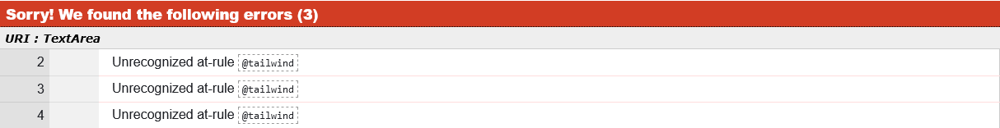

Note on W3C CSS Validator Errors for @tailwind Directives

During the validation of base.css with the W3C CSS Validator, i encountered errors related to the use of @tailwind at-rules. These errors typically appear as:

Unrecognized at-rule @tailwind

Explanation:

- Tailwind CSS Integration: The @tailwind directive is specific to Tailwind CSS, a utility-first CSS framework. This directive is used to inject Tailwind's base, components, and utilities styles into your CSS.

- Not Part of Standard CSS: Since @tailwind is a directive specific to Tailwind CSS and not a part of the standard CSS specifications, the W3C CSS Validator does not recognize it. This is expected behavior and not an indication of a problem with your CSS code.

- Pre-Processing Requirement: Tailwind CSS works by processing these directives through a build step using tools like PostCSS. During this build step, the @tailwind directives are replaced with the corresponding Tailwind CSS styles. The final output is standard CSS without any @tailwind directives.

HTML Results:

Home Page

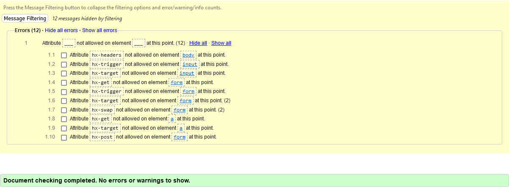

Explore Page

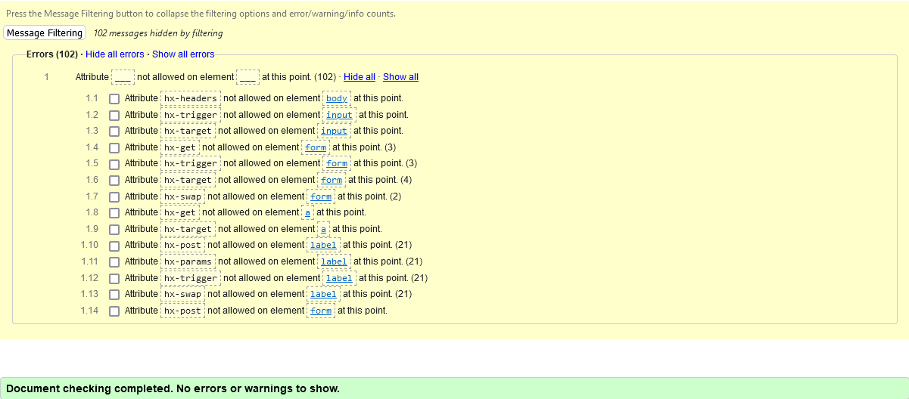

Trip Detail Page

Cart/Checkout Page

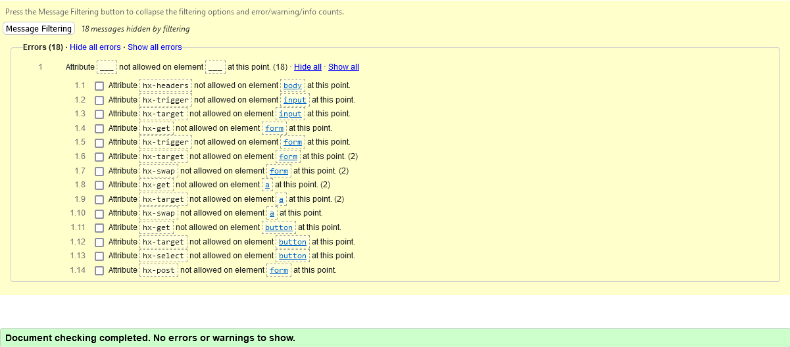

Profile Page

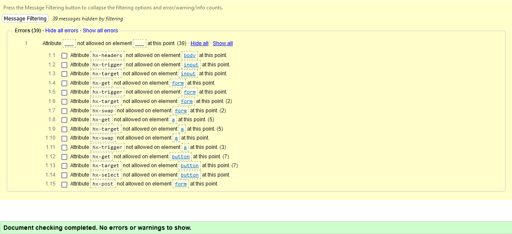

Checkout Success Page

Password Reset Page

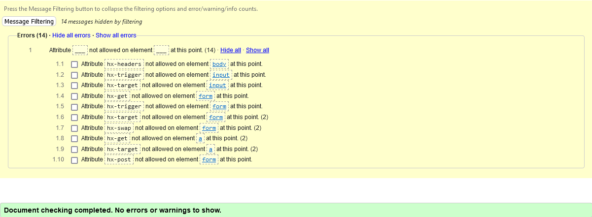

Password Reset Done Page

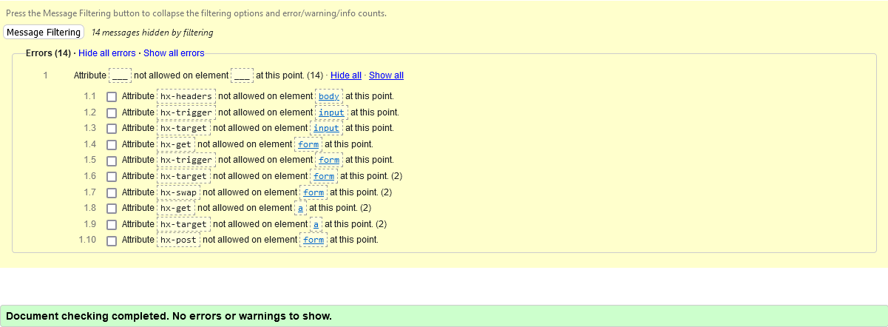

Confirm Email Page

Implication for Validation:
Due to the dynamic nature of content loading via HTMX, standard methods of viewing source code for validation purposes are not fully effective. The source code viewed in a browser typically represents the initial page load and does not reflect content dynamically loaded through HTMX.

Note on W3C CSS Validator Errors for HTMX Related Attributes.

HTMX Custom Attributes:

- HTMX extends HTML by introducing custom attributes starting with hx-. These attributes enable various AJAX functionalities directly in HTML, making it easier to create dynamic and responsive web pages without heavy JavaScript.

W3C Validation Errors:

- When validating HTML that uses HTMX, the W3C validator, which checks HTML against the official HTML specifications, reports errors for these custom attributes. This is because the validator only recognizes standard HTML attributes and is not aware of HTMX-specific enhancements.

Nature of These Errors:

- The reported errors are specific to HTMX's custom attributes. They indicate a deviation from standard HTML but do not imply any actual issue with how the HTMX-enhanced page will function. These attributes are essential for HTMX's AJAX capabilities and are correctly used within the context of an HTMX-enabled project.

Impact on Web Development:

- While these errors are flagged in validation, they do not impact the functionality or performance of web pages enhanced with HTMX. In the context of an HTMX project, these attributes are correctly used and crucial for enabling its features.

---

[⬆️Back to top](<#table-of-contents>)

### Wave Accessibility Results

Overview

The Wave Accessibility Test is a crucial component in ensuring that the application is accessible to all users, including those with disabilities. This test helps identify and address potential accessibility barriers within the web content, aligning the website with the Web Content Accessibility Guidelines (WCAG).
Purpose of the Test

- Enhancing User Accessibility: To ensure that the website is usable by people with a diverse range of hearing, movement, sight, and cognitive abilities.
- Compliance with Standards: To adhere to international accessibility standards, making the website more inclusive and reaching a broader audience.
- Improving User Experience: By addressing accessibility issues, the overall user experience is enhanced, making the website more navigable and intuitive for all users.

Testing Process

- The Wave Accessibility Tool was utilized to evaluate each page of the Mont Adventures website.
- The tool scanned for various accessibility features such as alternative text for images, proper heading structures, color contrast, ARIA roles, and more.
- Each page was individually assessed, and the tool provided feedback on errors, alerts, and features that support accessibility.

Key Findings

- Errors Identified: Specific errors that directly impact accessibility, such as missing alt text or empty links.
- Alerts Noted: Potential issues that may not impact accessibility but could improve the user experience if addressed.
- Features Highlighted: Aspects of the website that effectively support accessibility, such as proper heading structures and labels.

Action Taken

- Following the test results, necessary changes were implemented to rectify identified issues.
- Modifications included adding missing alternative text, adjusting color contrasts for better visibility.

Conclusion

The Wave Accessibility Test for Mont Adventures was an integral step in making the website more inclusive and user-friendly. The test results provided valuable insights into areas of improvement, leading to significant enhancements in the website's accessibility. Continued commitment to accessibility is essential for maintaining an inclusive digital presence.

Home Page

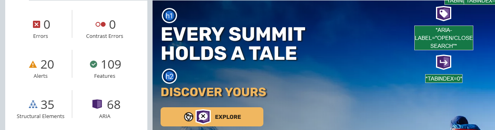

Explore Page

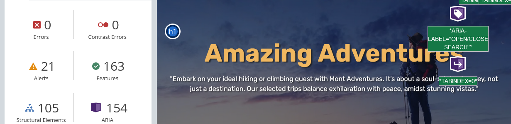

Trip Detail Page

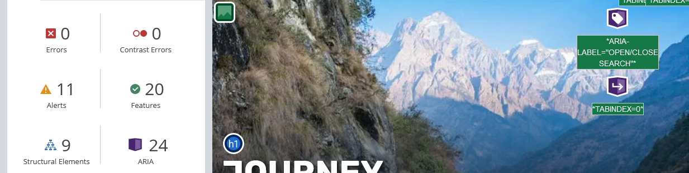

Cart/Checkout Page

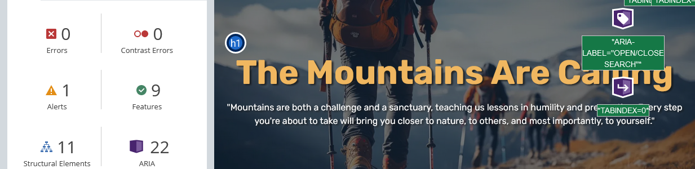

---

[⬆️Back to top](<#table-of-contents>)

### PageSpeed Insights Results

Overview

PageSpeed Insights is a powerful tool provided by Google that analyzes the content of a web page, then generates suggestions to make that page faster and more efficient. It measures various aspects of website performance, providing both a score and actionable recommendations.
Purpose of the Analysis

- Performance Evaluation: To assess how well the Mont Adventures website performs in terms of loading speed and responsiveness.
- User Experience Enhancement: Fast-loading pages improve user experience, especially on mobile devices.
- Search Engine Optimization: Page speed is a ranking factor for search engines, so optimizing for speed can help improve the website's search engine rankings.

Testing Process

- The PageSpeed Insights tool analyzes both the mobile and desktop versions of the website.
- It provides a performance score out of 100, categorizing the site as 'Good', 'Needs Improvement', or 'Poor'.
- The analysis includes metrics such as Largest Contentful Paint (LCP), First Input Delay (FID), and Cumulative Layout Shift (CLS).

Key Findings

- Performance Metrics: Detailed insights into various performance metrics, identifying areas where the website excels and areas needing improvement.
- Opportunities for Optimization: Specific recommendations on how to improve page loading times, such as optimizing images, leveraging browser caching, or minifying CSS and JavaScript.

Action Taken

- Following the analysis, implement the suggested optimizations to improve performance scores.
- Continuously monitor the website’s performance to ensure it remains optimized over time.

Conclusion

The PageSpeed Insights analysis for Mont Adventures provides a comprehensive view of the site's performance, highlighting critical areas for improvement. Implementing these recommendations not only enhances the user experience but also contributes positively to SEO efforts. Regular monitoring and optimization are key to maintaining a fast and efficient website.

First Analyze Report:

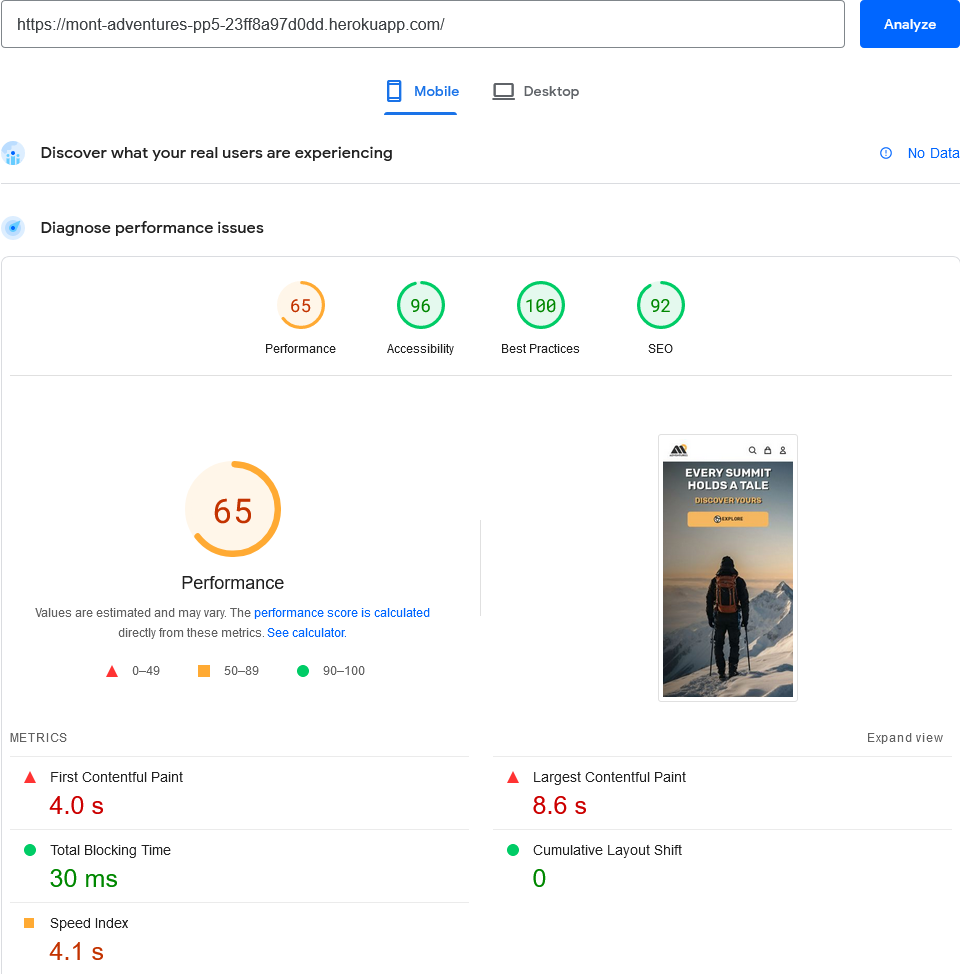
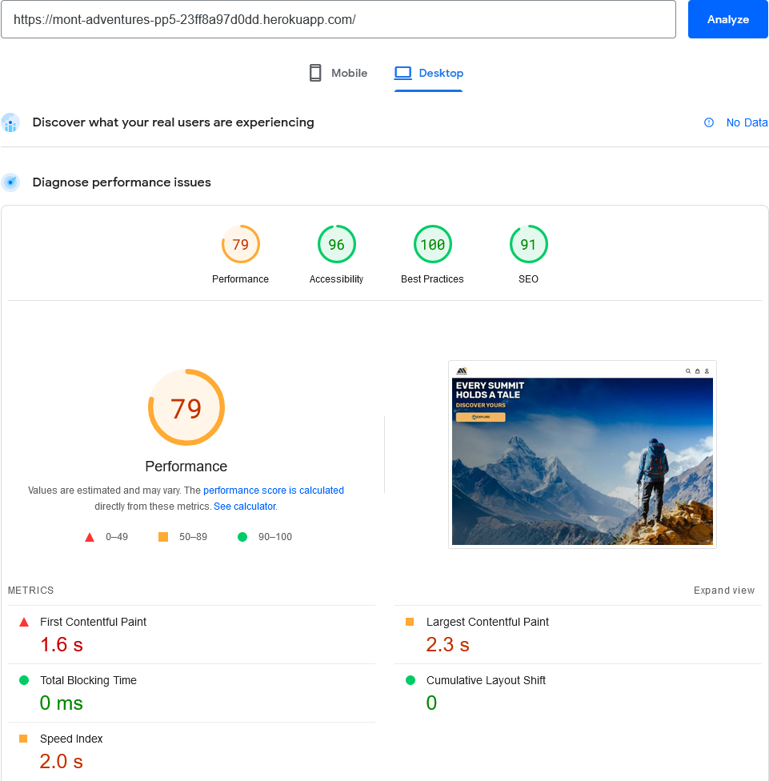

Last Analyze Report:

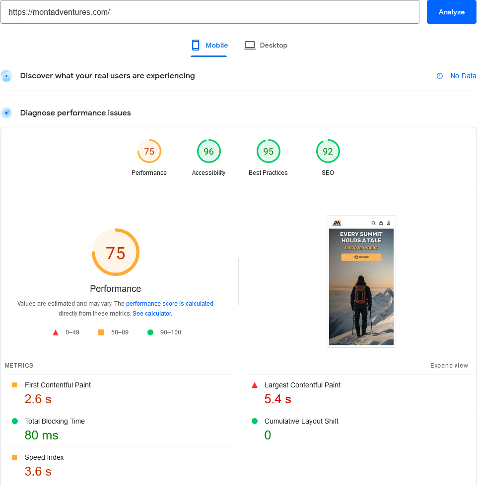
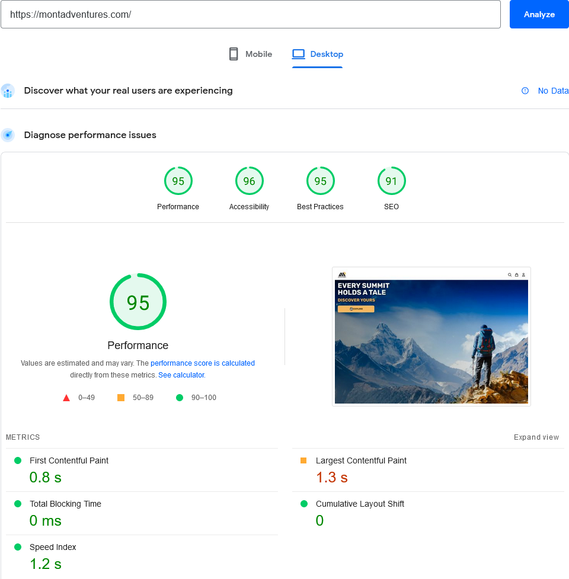

Current Optimizations

1. JavaScript Optimization:

- Action Taken: Deferred loading of several JavaScript files.
- Impact: This reduced the initial load time by delaying the loading of non-critical JavaScript, thereby improving the site's interactivity metrics.

2. CSS Optimization:

- Action Taken: Minified the TailwindCSS output file.
- Impact: The reduction in CSS file size led to a quicker download and parse time, slightly enhancing the overall page speed.

Results and Reflection

- The above optimizations led to a slight increase in the site's speed score.
- Given the time constraints, these initial improvements are satisfactory for the current phase of the project.
- Recognizing that further detailed analysis and optimization are required for more significant performance gains.

Future Optimization Plans

1. Caching Strategy:

- Plan: To implement a more robust caching strategy upon final build deployment.
- Method: Utilize Cloudflare's caching capabilities to optimize content delivery and further improve load times.
- Expectation: Anticipate noticeable improvements in page loading speed, especially for repeat visitors.

2. Additional Cloudflare Features:

- Exploration: Investigate other Cloudflare features such as image optimization (Polish), Argo routing, and advanced caching techniques.
    Goal: To leverage these features for enhanced performance and efficiency.

Conclusion

- The initial steps taken have resulted in a moderate improvement in site performance.
- Recognizing the importance of ongoing optimization, further enhancements will be pursued post-launch, particularly focusing on caching and Cloudflare's advanced capabilities.
- Continuous monitoring and iterative improvements will be key to maintaining optimal site performance.

---

[⬆️Back to top](<#table-of-contents>)

### Bugs and Fixes

Overview of Bug Handling

Throughout the development of Mont Adventures, numerous small bugs were encountered. However, these were typically minor and swiftly rectifiable, addressed promptly as part of the development workflow.
Current Bug Status

- As of the latest release, no critical bugs have been identified that impede the full functionality and navigability of the application.
- The focus has been on ensuring a smooth and error-free experience for the end user.

Notable Non-Critical Bug

Issue: In the production environment, an anomaly has been observed in the profile edit form, specifically in the country select dropdown. An additional arrow appears in the dropdown, which is not present in the development environment.

- Suspected Cause: The issue is presumed to be related to the integration of Crispy Tailwind forms, possibly a minor styling conflict or a rendering issue specific to the production environment.
- Current Impact: This bug is not critical to the application's functionality. The form remains usable, and the issue is largely cosmetic.
- Screenshots:

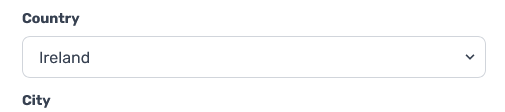
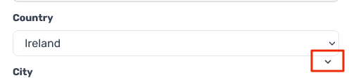

Plan for Resolution

- While this issue is not currently critical, it is earmarked for future investigation and resolution.
- A deeper analysis will be conducted to isolate the cause, potentially examining the interplay between Tailwind CSS, Crispy forms, and the production environment's specifics.

Conclusion

The proactive approach in addressing bugs during development has resulted in a stable release of Mont Adventures. The ongoing commitment to refining and enhancing the application will continue to address any such minor issues as part of regular maintenance and updates.

---

[⬆️Back to top](<#table-of-contents>)

### Conclusion

As I conclude the comprehensive testing phase for Mont Adventures, it's an opportune moment to reflect on the journey, the challenges faced, and the accomplishments achieved.
Key Achievements

- Thorough Testing Approach: The application underwent a range of tests, from unit to user acceptance testing, ensuring every facet was rigorously evaluated for quality and functionality.
- Performance Enhancements: Efforts to optimize performance, such as deferring JavaScript and minifying CSS, have resulted in notable improvements, demonstrating a commitment to efficient and responsive design.
- Accessibility and User Experience: Adherence to accessibility standards and a focus on user experience were central to my approach, leading to an inclusive and engaging application.
- Responsive Design Mastery: Testing across various devices affirmed the application's adaptability and seamless user experience across different platforms.

Challenges and Learning

- Balancing Quality with Time Constraints: One of the significant challenges was managing the extensive scope of testing within the project timeline, which taught me valuable lessons in prioritization and time management.
- Debugging Production Environment: Encountering and addressing issues unique to the production environment highlighted the importance of thorough, environment-specific testing.

Looking Ahead

- Commitment to Continuous Improvement: The development journey doesn't end here. I'm dedicated to ongoing improvement and updates, ensuring Mont Adventures stays ahead in terms of technology and user satisfaction.
- Valuing Monitoring and User Feedback: Regular monitoring and user feedback will be crucial in refining and enhancing the application further.

Final Thoughts

The testing phase for Mont Adventures has been a challenging yet rewarding solo endeavor. It has not only improved the application's current state but also equipped me with insights and experiences that will benefit future projects. Launching this version of Mont Adventures, I'm confident in its quality, functionality, and the positive experience it will offer users. I look forward to the ongoing journey and the new opportunities it will bring.

---

[⬆️Back to top](<#table-of-contents>)